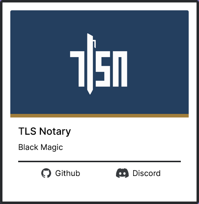

# Privacy and Scaling Explorations
Main branch served at: https://projects.appliedzkp.org/

This is the React re-write of the PSE website, formally just a landing page.

## How to contribute

### Add / Change a Project Entry

All the projects are stored in the `projects.json` file in `/src/components/`

Here is an example of a project's entry:

``` json
{
    "name": "TLS Notary",
    "short_name": "TLSN",
    "description": "Black Magic",
    "long_description": "Black Magic",
    "image": "tlsn.png",
    "links": [
      {
        "github": "https://github.com/tlsnotary/tlsn"
      },
      {
        "discord": "https://discord.gg/EjpvcEaqkh"
      }
    ]
  }
```

Which results in this project card:



#### Name / Short Name

`name` is the name of the project, and `short_name` is the name that will be used for a placeholder image if an image isn't included or can't be found.

#### Description / Long Description

`description` is the description of the project in roughly the size of a tweet (so it fits on the project card), and `long_description` is the description that will be used for the project's page/pop out card (in the works now).

#### Project Logos / Images

Project logos/images are stored in `/src/images` and the file name needs to be listed in the project's entry in `projects.json` as `"image": "filename.png"`.

#### Links

Links can be `website`, `github`, `discord`, `twitter`, or `telegram`. If you want more options like that added (like Reddit for example), please create an [issue](https://github.com/AtHeartEngineering/pse_landingpage/issues/new).

### Have an idea?

Create an [issue](https://github.com/AtHeartEngineering/pse_landingpage/issues/new) and tell us the idea!

### Want to contribute?

Feel free to fork this repo and make a pull request!
